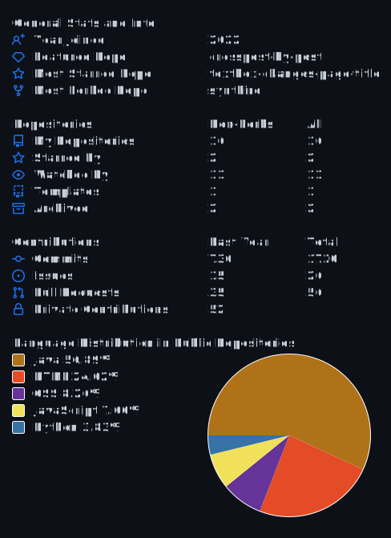

## ```<greeting>```Hi there! I'm Synthird!```</greeting>```

- 🕛 I've been programming since mid 2020.
  - 🕹️ I got into it when I started learning to make video games.
  - 📘 The first language I learned was [Lua](https://lua.org/).
- 🎨 I also create [art](https://cara.app/synthird) and other things.
- ⚡ Fun fact: You're reading this in the present!

<details>
  <summary>:octocat: GitHub activity card (Doesn't indicate proficiency.)</summary> <br>

  [](https://github.com/cicirello/user-statistician)
</details>


<!--
**Synthird/Synthird** is a ✨ _special_ ✨ repository because its `README.md` (this file) appears on your GitHub profile.

Here are some ideas to get you started:

- 🔭 I’m currently working on ...
- 🌱 I’m currently learning ...
- 👯 I’m looking to collaborate on ...
- 🤔 I’m looking for help with ...
- 💬 Ask me about ...
- 📫 How to reach me: ...
- 😄 Pronouns: ...
- ⚡ Fun fact: ...
-->
